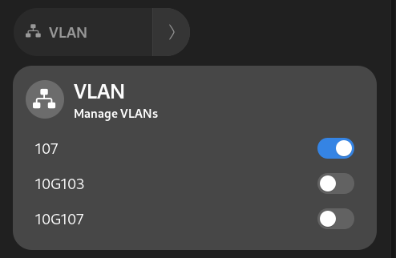
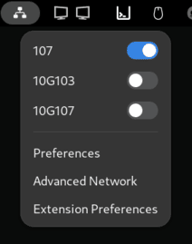
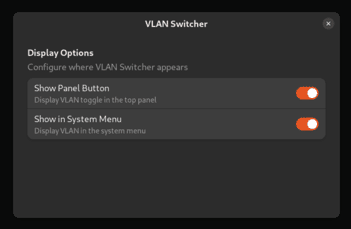

# GNOME VLAN Switcher

### An updated GNOME extension to activate and deactivate VLAN connections from the system panel or top bar.

<p align="center">
    Dropdown menu
    
    <br>
    Topbar option
    
</p>

You can toggle on/off the both option in preference  

<p align="center">
    
</p>

## Installation from source code

```bash
cd ~/.local/share/gnome-shell/extensions/
rm -r updated-vlan-switcher@jrvolt.github.io
git clone https://github.com/JrVolt/GNOME_VLAN_Toggle updated-vlan-switcher@jrvolt.github.io
```

Now log out and log back in to reload the extensions.

## Usage

This will let you activate or deactivate existing VLAN connections, managed by the network manager. You first need to create the VLANs with your preferred tool, such as `nm-connection-editor`. The status of each connections is refreshed only when you open the popup menu.

## License

Forked from 'u/darcato' [vlan switcher](https://github.com/darcato/gnome-vlan-switcher)
<br>
[GPLv3](http://www.gnu.org/licenses/gpl-3.0.en.html)
